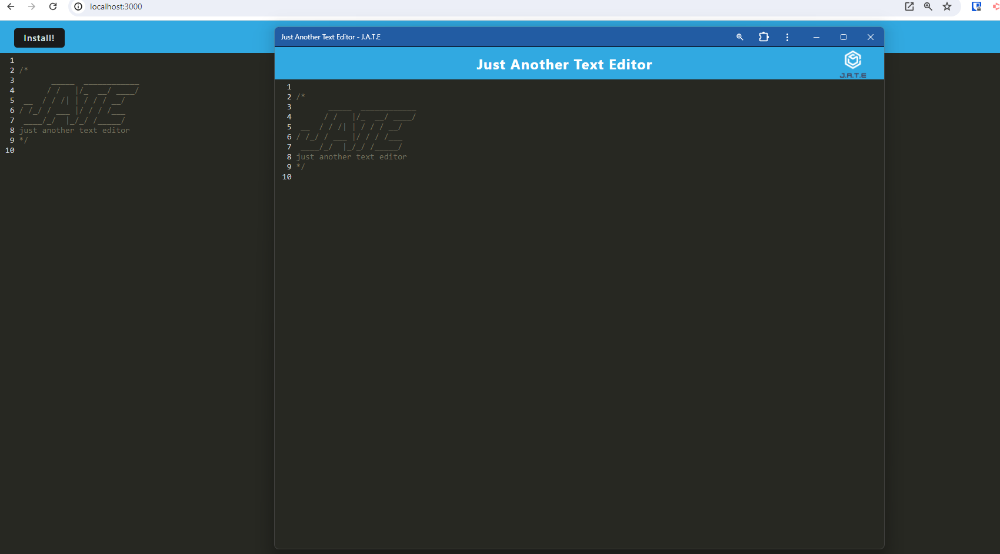
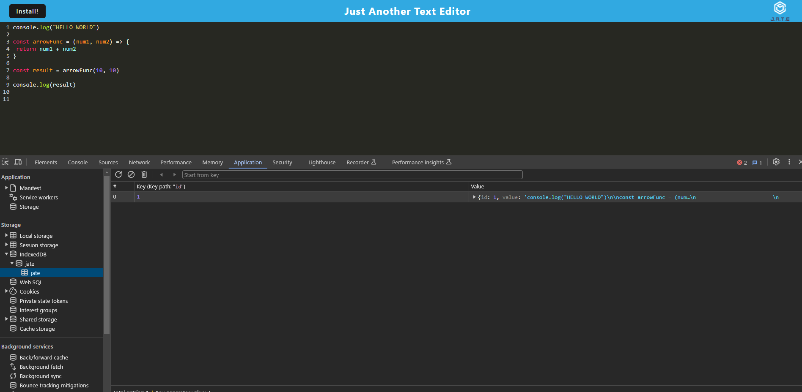
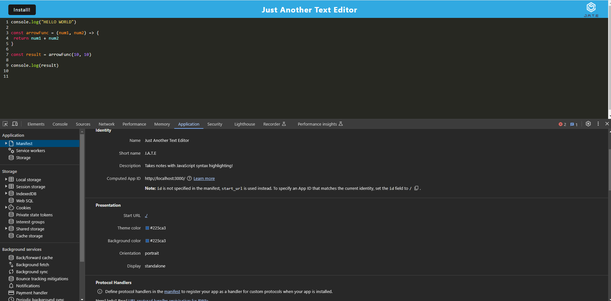
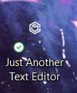
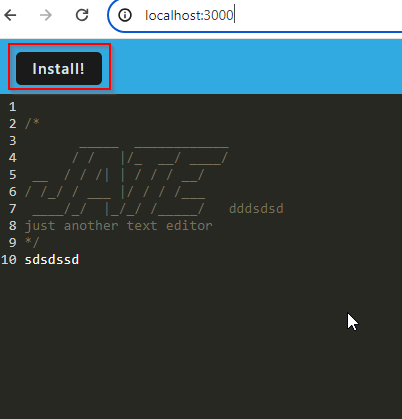

# Progressive Web Application: Text Editor

## Description

This application is a text editor that runs in the browser. The app is a single page applicatoin that meets the PWA criteria. Additionally it will feature a number of data persistence techniques that serve as redunancy in case one of the options is not supported by the browser. The application also has the functionality to work offline.

## Problem Solving

Building this project has allowed for not only the capability of having a central location to store notes but also being able to access them whenever and where-ever. This is thanks to the service worker technology that is implemented to this web application alongside with the IndexedDB API.

## Learning

Throughout buidling this project I learned how to implement the Service Worker API which allows for effective offline experiences, IndexedDB to store data locally in the browser and utilising the webpack configuration to allow us to bundle everything together. Overall, undergoing this project has taught me a lot about Progressive Web Applications and has shown how beneficial and powerful they can be in today's world.

## Table of Contents

- [Installation](#installation)

- [Usage](#usage)

- [License](#license)

- [Contributing](#contributing)

- [Tests](#tests)

- [Questions](#questions)

## Installation

To install and run this project locally, follow these steps:

1. Clone the repository to your local machine.
    
    git clone git@github.com:Y1va/pwa-TxtEditor.git

2. Open the project folder in your code editor.

3. Install the necessary dependencies by running the command:

    `npm install`

## Usage

Once all necessary dependencies have been installed you can run the application following these steps:

  1. Start the server from the terminal with `npm run start`
  
  2. Open the application in the browser and put http://localhost:3000/ in the url bar. After writing some notes, don't be afraid to close the tab when you are done with it as everything gets stored locally thanks to the IndexedDB. The following screenshots will show the working IndexedDB, Service workers and the Manifest file. There will also be a screenshot of the downloaded application.

  In the screenshots, I have written some JavaScript code to demonstrate the capability of the JavaScript syntax highlighting.

3. Here is the downloaded application, do note that this only works when the server is running as it is utilising the localhost in the browser and the server needs to be on for it to be reachable.

4. If you want to install the application just click on the install button shown in the screenshot below:

## Deployed application to Render

You can access the deployed application which is hosted on Render through this link: 

## License

    This project is licensed under the MIT License

## Contributing

I will not be accepting contributions to this repository at this time.

## Tests

N/A

## Questions

If you have any questions, feel free to reach out to me at ponzeadrian@gmail.com. Find my other projects at [Y1va](https://github.com/Y1va/).
